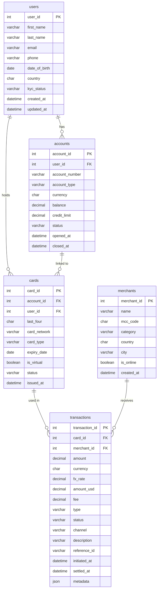

# SQL Practice — Card Transactions Database

A self-contained MySQL practice environment built around a realistic card-payments schema. Write queries against real-looking data covering users, bank accounts, payment cards, merchants, and transactions.

## What's in this repo

| File | Purpose |
|---|---|
| `schema.sql` | Creates all five tables and indexes |
| `seed.sql` | Populates the database with realistic sample data |
| `questions.sql` | 45 practice questions across 7 difficulty levels |
| `answers.sql` | Reference answers for every question |
| `queries.sql` | Scratch space for your own queries |
| `advanced-sql-questions.sql` | Hard questions: window frames, recursive CTEs, pivots, gap/island detection |

---

## Entity Relationship Diagram



---

## Getting started

### Prerequisites

- MySQL 8.0 or later
- A MySQL user with `CREATE`, `INSERT`, `SELECT`, and `DROP` privileges

### 1. Clone the repo

```bash
git clone https://github.com/ani0x53/sql-prac.git
cd sql-prac
```

### 2. Create a database

```sql
mysql -u your_user -p
```

```sql
CREATE DATABASE sql_prac CHARACTER SET utf8mb4 COLLATE utf8mb4_unicode_ci;
USE sql_prac;
```

### 3. Load the schema

```bash
mysql -u your_user -p sql_prac < schema.sql
```

### 4. Seed sample data

```bash
mysql -u your_user -p sql_prac < seed.sql
```

### 5. Start practising

Open `questions.sql` in your editor, pick a question, write your answer in `queries.sql`, and check it against `answers.sql`. The questions go from basic `SELECT`s up to window functions, CTEs, and tricky analytical problems.

---

## Optional: Installing MySQL

### macOS (Homebrew — recommended)

```bash
brew install mysql
brew services start mysql
mysql_secure_installation   # follow the prompts to set a root password
```

Create a practice user (run as root):

```sql
CREATE USER 'prac'@'localhost' IDENTIFIED BY 'changeme';
GRANT ALL PRIVILEGES ON sql_prac.* TO 'prac'@'localhost';
FLUSH PRIVILEGES;
```

### Linux (Ubuntu / Debian)

```bash
sudo apt update
sudo apt install mysql-server
sudo systemctl start mysql
sudo mysql_secure_installation
```

Create a practice user:

```bash
sudo mysql
```

```sql
CREATE USER 'prac'@'localhost' IDENTIFIED BY 'changeme';
GRANT ALL PRIVILEGES ON sql_prac.* TO 'prac'@'localhost';
FLUSH PRIVILEGES;
```

### Linux (RHEL / Fedora / Rocky)

```bash
sudo dnf install mysql-server
sudo systemctl enable --now mysqld
sudo mysql_secure_installation
```

Then create the user the same way as above.

### Windows

1. Download the **MySQL Installer** from [dev.mysql.com/downloads/installer](https://dev.mysql.com/downloads/installer/).
2. Run the installer, choose **Developer Default**, and follow the setup wizard. It will install MySQL Server, MySQL Workbench, and the Shell.
3. During setup, set a root password when prompted.
4. After installation, open **MySQL Workbench** or **MySQL Shell** and run:

```sql
CREATE USER 'prac'@'localhost' IDENTIFIED BY 'changeme';
GRANT ALL PRIVILEGES ON sql_prac.* TO 'prac'@'localhost';
FLUSH PRIVILEGES;
```

To load the SQL files from the command line:

```cmd
"C:\Program Files\MySQL\MySQL Server 8.0\bin\mysql.exe" -u prac -p sql_prac < schema.sql
"C:\Program Files\MySQL\MySQL Server 8.0\bin\mysql.exe" -u prac -p sql_prac < seed.sql
```

---

## Question levels

| Level | Topic | Questions |
|---|---|---|
| 1 | Basics — SELECT, WHERE, ORDER BY | Q1–Q7 |
| 2 | JOINs — INNER, LEFT, self-join | Q8–Q13 |
| 3 | Aggregates & GROUP BY | Q14–Q20 |
| 4 | Subqueries | Q21–Q26 |
| 5 | Window functions | Q27–Q32 |
| 6 | CTEs | Q33–Q36 |
| 7 | Advanced / mixed | Q37–Q45 |
| — | Advanced (separate file) | AQ1–AQ20 |
